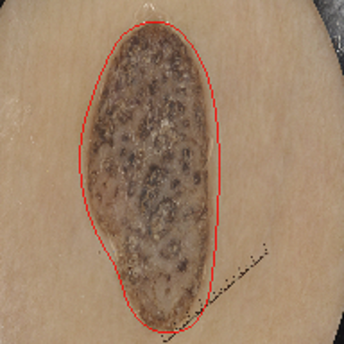
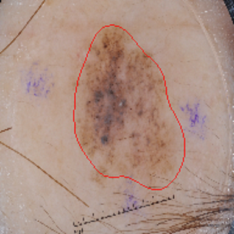
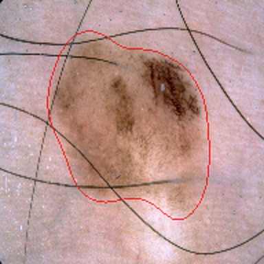
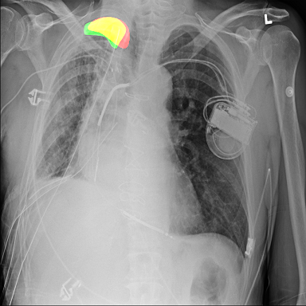
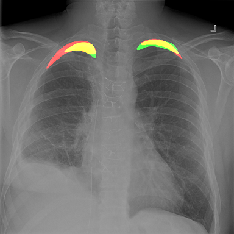
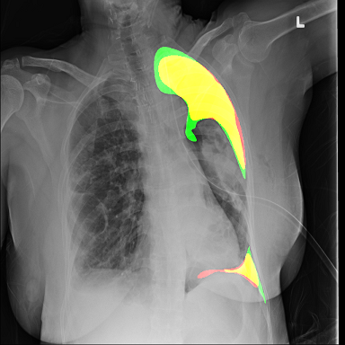
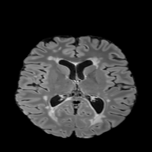
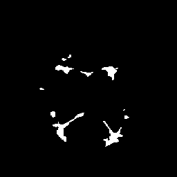
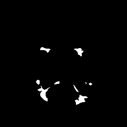

# DH USE CASE Pipeline 

Pipeline that uses EDDL and ECVL to train a CNN on five different datasets (_MNIST_, _ISIC_, _PNEUMOTHORAX_, _MSSEG_ and _DHUC11_), applying different image augmentations, for both the classification and the segmentation task.

| ECVL  | EDDL   |  
|-------|--------|
| 1.0.3 | 1.0.4b | 

## Requirements
- CMake 3.13 or later
- C++ Compiler with C++17 support (e.g. GCC 7 or later, Clang 5.0 or later, Visual Studio 2017 or later)
- (Optional) ISIC dataset.
- (Optional) Pneumothorax dataset.
- (Optional) MSSEG dataset.

### Datasets
The YAML datasets format is described [here](https://github.com/deephealthproject/ecvl/wiki/DeepHealth-Toolkit-Dataset-Format). Each dataset listed below contains both the data and the YAML description format, but they can also be downloaded separately: [ISIC classification](datasets/isic_classification.yml), [ISIC segmentation](datasets/isic_segmentation.yml), [Pneumothorax segmentation](datasets/pneumothorax.yml), [Kidney segmentation](datasets/kidney_segmentation.yml), [Kidney classification](datasets/kidney_classification.yml), [Multiple Sclerosis Segmentation](datasets/msseg.yml).


#### MNIST
Automatically downloaded and extracted by CMake.

#### ISIC - [isic-archive.com](https://challenge.isic-archive.com/challenges)

[_Classification_](https://challenge.isic-archive.com/landing/2019): Download it from [here](https://drive.google.com/uc?id=1TCE-uswZ41nlqMe5SWHoCGF7Mtq6r15A&export=download) and extract it. To run skin_lesion_classification you must provide the `--dataset_path` as `/path/to/isic_classification.yml` (section [Training options](#c-training-options) list other settings). See [Pretrained models](#pretrained-models) section to download checkpoints.

[_Classification_2018_](https://challenge.isic-archive.com/landing/2018/47): Download it from [here](https://drive.google.com/uc?id=15byB4RbfXv3-uVNdETRyAGWINMmBgYvI&export=download) and extract it. To run skin_lesion_classification_2018 you must provide the `--dataset_path` as `/path/to/isic_classification_2018.yml`.

_Segmentation_: Download it from [here](https://drive.google.com/uc?id=1RyYa32x9aqwd2kkQpCZ4Xa2h_VcgH3wI&export=download) and extract it. To run skin_lesion_segmentation you must provide the the `--dataset_path` as `/path/to/isic_segmentation.yml` (section [Training options](#c-training-options) list other settings). See [Pretrained models](#pretrained-models) section to download checkpoints.

#### PNEUMOTHORAX
Dataset taken from a kaggle challenge (more details [here](https://www.kaggle.com/c/siim-acr-pneumothorax-segmentation)).
  1. Download training and test images [here](https://www.kaggle.com/seesee/siim-train-test/download).
  1. Download from [here](https://drive.google.com/uc?id=1e9f0LzPB8euHRJLA5URknUFZHD-8AtE9&export=download) ground truth masks and the YAML dataset file.
  1. In order to copy the ground truth masks in the directory of the corresponding images, edit the `cpp/copy_ground_truth_pneumothorax.cpp` file with the path to the downloaded dataset and ground truth directory and run it. Move the YAML file in the `siim` dataset folder.
  
  Short [video](https://drive.google.com/uc?id=17qlmm9Jf_D3K4iB3Y9pfrpDssFxk2q69&export=download) in which these steps are shown.
  
From the 2669 distinct training images with mask, 200 are randomly sampled as validation set.
- Training set: 3086 total images - 80% with mask and 20% without mask.
- Validation set: 250 total images - 80% with mask and 20% without mask.

#### KIDNEY SEGMENTATION AND CLASSIFICATION
UC11 dataset, images cannot be provided publicly.

### MULTIPLE SCLEROSIS LESION SEGMENTATION
Dataset of the MSSEG challenge which took place during MICCAI 2016 (https://portal.fli-iam.irisa.fr/msseg-challenge).
1. Subscribe the challenge in order to dowload data [here](https://portal.fli-iam.irisa.fr/msseg-challenge/overview?p_p_id=registration_WAR_fliiamportlet&p_p_lifecycle=0&p_p_state=normal&p_p_mode=view&p_p_col_id=column-1&p_p_col_pos=1&p_p_col_count=3&_registration_WAR_fliiamportlet_mvcPath=%2Fhtml%2Fregistration%2Fregistration.jsp).
    1. Create the MSSEG directory (`mkdir MSSEG`)
    1. Download the `Unprocessed training dataset` from [here](https://portal.fli-iam.irisa.fr/documents/20182/22089/Unprocessed+training+dataset/d487c807-8fd2-4fa0-892e-53d4578f343a?version=1.2) and place the zip inside `MSSEG`.
    1. Download the `Pre-processed training dataset` from [here](https://portal.fli-iam.irisa.fr/documents/20182/22089/Pre-processed+training+dataset/6f1a997b-8d32-4791-b124-a35ee4fc4655?version=1.2) and place the zip inside `MSSEG`.
1. Download the script at [https://raw.githubusercontent.com/deephealthproject/use_case_pipeline/3rd_hackathon/dataset/extract_data.sh](https://raw.githubusercontent.com/deephealthproject/use_case_pipeline/3rd_hackathon/dataset/extract_data.sh), save it in `MSSEG` folder, and run it.
    ```shell
    cd ~
    mkdir MSSEG && cd MSSEG
    wget https://raw.githubusercontent.com/deephealthproject/use_case_pipeline/3rd_hackathon/dataset/extract_data.sh
    chmod +x extract_data.sh
    ./extract_data.sh
    ```
1. Place the `ms_segmentation.yaml` and put it inside `MSSEG` directory.
    ```shell
    wget https://raw.githubusercontent.com/deephealthproject/use_case_pipeline/3rd_hackathon/dataset/ms_segmentation.yml
    ```

### CUDA
On Linux systems, starting from CUDA 10.1, cuBLAS libraries are installed in the `/usr/lib/<arch>-linux-gnu/` or `/usr/lib64/`. Create a symlink to resolve the issue:
```bash
sudo ln -s /usr/lib/<arch>-linux-gnu/libcublas.so /usr/local/cuda-10.1/lib64/libcublas.so
```

## Building

- **\*nix**
    - Building from scratch, assuming CUDA driver already installed if you want to use GPUs ([video](https://drive.google.com/uc?id=1xGPHIEXK-vzxEF0y8N148EhFud1Ackm4&export=download) in which these steps are performed in a clean nvidia docker image):
        ```bash
        sudo apt update
        sudo apt install wget git make gcc-8 g++-8

        # cmake version >= 3.13 is required for ECVL
        wget https://cmake.org/files/v3.13/cmake-3.13.5-Linux-x86_64.tar.gz
        tar -xf cmake-3.13.5-Linux-x86_64.tar.gz

        # symbolic link for cmake
        sudo ln -s /<path/to>/cmake-3.13.5-Linux-x86_64/bin/cmake /usr/bin/cmake
        # symbolic link for cublas if we have cuda >= 10.1
        sudo ln -s /usr/lib/<arch>-linux-gnu/libcublas.so /usr/local/cuda-10.1/lib64/libcublas.so

        # if other versions of gcc (e.g., gcc-7) are present, set a higher priority to gcc-8 so that it is chosen as the default
        sudo update-alternatives --install /usr/bin/gcc gcc /usr/bin/gcc-8 80 --slave /usr/bin/g++ g++ /usr/bin/g++-8
        sudo update-alternatives --install /usr/bin/gcc gcc /usr/bin/gcc-7 70 --slave /usr/bin/g++ g++ /usr/bin/g++-7

        git clone https://github.com/deephealthproject/use-case-pipelines.git
        cd use-case-pipelines

        # install dependencies as sudo so that they will be installed in "standard" system directories
        chmod u+x install_dependencies.sh
        sudo ./install_dependencies.sh

        # install EDDL, OpenCV, ECVL and build the pipeline
        chmod u+x build_pipeline.sh
        ./build_pipeline.sh
        ```

    - Building with all the dependencies already installed:
        ```bash
        git clone https://github.com/deephealthproject/use-case-pipelines.git
        cd use-case-pipelines
        mkdir build && cd build

        # if ECVL is not installed in a "standard" system directory (like /usr/local/) you have to provide the installation directory
        cmake -Decvl_DIR=/<path/to>/ecvl/build/install ..
        make
        ```
    
- **Windows**
    - Building assuming `cmake >= 3.13`, `git`, Visual Studio 2017 or 2019, CUDA driver (if you want to use GPUs) already installed 
        ```bash
        # install EDDL and all its dependencies, OpenCV, ECVL and build the pipeline
        git clone https://github.com/deephealthproject/use-case-pipelines.git
        cd use-case-pipelines
        build_pipeline.bat
        ```
    
**N.B.** EDDL is built for GPU by default.
    
## Training and inference

The project creates different executables: MNIST_BATCH, MNIST_BATCH_FASTER, SKIN_LESION_CLASSIFICATION, SKIN_LESION_SEGMENTATION, PNEUMOTHORAX_SEGMENTATION, KIDNEY_SEGMENTATION, KIDNEY_CLASSIFICATION, MS_SEGMENTATION.

- Training:
    1. MNIST_BATCH load the dataset with the deprecated ECVL LoadBatch which is not parallelized. All the other executables run with a custom number of parallel threads. Default settings [here](https://github.com/deephealthproject/use-case-pipelines/blob/91a7b58904811fc475cdf61b4ade04c33fc085ae/cpp/mnist_batch.cpp#L18).
    1. MNIST_BATCH_FASTER ([default settings](https://github.com/deephealthproject/use-case-pipelines/blob/91a7b58904811fc475cdf61b4ade04c33fc085ae/cpp/mnist_batch_faster.cpp#L17)) and SKIN_LESION_CLASSIFICATION ([default settings](https://github.com/deephealthproject/use-case-pipelines/blob/91a7b58904811fc475cdf61b4ade04c33fc085ae/cpp/skin_lesion_classification.cpp#L111)) train the neural network loading the dataset in batches (needed when the dataset is too large to fit in memory).
    1. SKIN_LESION_SEGMENTATION ([default settings](https://github.com/deephealthproject/use-case-pipelines/blob/91a7b58904811fc475cdf61b4ade04c33fc085ae/cpp/skin_lesion_segmentation.cpp#L122)) trains the neural network loading the dataset (images and their ground truth masks) in batches for the segmentation task.
    1. PNEUMOTHORAX_SEGMENTATION ([default settings](https://github.com/deephealthproject/use-case-pipelines/blob/91a7b58904811fc475cdf61b4ade04c33fc085ae/cpp/pneumothorax_segmentation.cpp#L219)) trains the neural network loading the dataset (images and their ground truth masks) in batches with a custom function for this specific segmentation task.
    1. KIDNEY_SEGMENTATION ([default settings](https://github.com/deephealthproject/use-case-pipelines/blob/bd70e0ce905f368de846098388e7da9ab4126e98/cpp/kidney_segmentation.cpp#L191)) trains the neural network loading the dataset (volumes and their ground truth masks), dividing them in slices with a custom function for this specific segmentation task.
    1. KIDNEY_CLASSIFICATION ([default settings](https://github.com/deephealthproject/use-case-pipelines/blob/8632351989c0279b1f4339a2b4d1d2fa343a422b/cpp/kidney_classification.cpp#L205)) trains the neural network loading the dataset (DICOM images and their labels), and calculate the metrics aggregating the predictions for each patient.
    1. MS_SEGMENTATION trains the neural network loading the dataset (volumes and their ground truth masks) in batches with a custom function for this specific segmentation task. Each volume is loaded in memory and then some slices (specified by `in_channels` variable) are extracted and used as input for the neural network.

- Inference:
    1. To perform only inference the `--skip_train` option has to be provided, and you will most likely want to provide a checkpoint with weights from a previous training process as well with the `--checkpoint` option. See [Pretrained models](#pretrained-models) section for checkpoints. For SKIN_LESION_SEGMENTATION you can perform the ensemble providing the `--checkpoint_dir` as the folder with all your checkpoints and the `--ensemble` option.

### C++ Training options
    -e, --epochs            Number of training epochs
    -b, --batch_size        Number of images for each batch
    -n, --num_classes       Number of output classes
    -s, --size              Size to which resize the input images
    --loss                  Loss function
    -l, --learning_rate     Learning rate
    --momentum              Momentum (default: 0.9)
    --model                 Model of the network
    -g, --gpu               Which GPUs to use. If not given, the network will run on CPU. (examples: --gpu 1 or --gpu=0,1 or --gpu=1,1)
    --lsb                   How many batches are processed before synchronizing the model weights (default: 1)
    -m, --mem               CS memory usage configuration (default: low_mem, other possibilities: mid_mem, full_mem)
    --save_images           Save validation images or not (default: false)
    -r, --result_dir        Directory where the output images will be stored (default: ../output_images)
    --checkpoint_dir        Directory where the checkpoints will be stored (default: ../checkpoints)
    -d, --dataset_path      Dataset path (mandatory - except for the mnist pipelines)
    -c, --checkpoint        Path to the onnx checkpoint file
    --exp_name              Experiment name
    -i, --input_channels    Number of the network input channels
    -w --workers            Number of parallel threads which produce tensors from images and labels
    -q, --queue_ratio       Maximum queue size in which producers store samples will be: batch_size\*workers\*queue_ratio
    --resume                Resume training from this epoch
    -t, --skip_train        Skip training and perform only test (default: false)
    --ensemble              Perform ensemble (only available for skin_lesion_segmentation)
    -h, --help              Print usage

### Pretrained models

|                     |   Model    |   Metric   |  Validation  |  Test    |  ONNX  
----------------------|------------|------------|--------------|----------|---------------------------------------
| ISIC classification |   ResNet50    |  Accuracy  |  0.854  |  0.8394 | [download](https://drive.google.com/file/d/1KO2SBIrV3jx97-dh6qDw3eACqFdPz6TI/view?usp=sharing)
| ISIC classification 2018 |   ResNet152    |  Accuracy  |  0.887  |  0.896 | [download](https://drive.google.com/file/d/1Cht7fDqfuUgQPvwVIWs93R9uWk3S5Ip9/view?usp=sharing)
| Kidney segmentation   |  UNet  |    Dice    |  0.8786  |  0.8634  | [download](https://drive.google.com/uc?id=1HcTF2fJtZmwh0rovKA4Ol-q7s8zE8u9U&export=download)
| Kidney classification   |  ResNet101  |    Accuracy    |  0.5545  |  0.6489  | [download](https://drive.google.com/uc?id=1Ju8swjuxb_mtV0-CBObf0EVUE5ZP8Wj5&export=download)
| MS segmentation     | Nabla   |  Dice   | 0.83  | 0.81  | [download](https://drive.google.com/uc?id=1lUXjWrGd1Gl2dRLXTOoIULvBH1Ik-qg-&export=download)

|                     |   Model    |   Metric   |  Validation  |  Test    |  ONNX  
----------------------|------------|------------|--------------|----------|---------------------------------------
| ISIC segmentation   |  DeepLabV3Plus  |    MIoU    |  0.746  |  0.746  | [download](https://drive.google.com/file/d/1rrChvu6BUaNnyWoMu4Qy0HMHt9cYut6X/view?usp=sharing)
| ISIC segmentation   |  SegNet (BCE) |    MIoU    |  0.750  |  0.770  | [download](https://drive.google.com/file/d/1wx9sAbJFIl4LXqjjGe6HPF9CQld3Zhvm/view?usp=sharing)
| ISIC segmentation   |  SegNet (Dice) |    MIoU    |  0.756  |  0.768  | [download](https://drive.google.com/file/d/1g3QtUlaG7x-unzak6N9iCdIkL9zXwfHt/view?usp=sharing)
| ISIC segmentation   |  UNet++  |    MIoU    |  0.782  |  0.771  | [download](https://drive.google.com/file/d/1AcQRpFQQN9T5TRPKFZMkb2-1tqnX1EBB/view?usp=sharing)
| ISIC segmentation   |  UNet  |    MIoU    |  0.770  |  0.763  | [download](https://drive.google.com/file/d/16eNEdJ471IWIR0iSHaqEiyrScmFvkHl2/view?usp=sharing)
| ISIC segmentation   |  LinkNet (VGG) |    MIoU    |  0.770  |  0.752  | [download](https://drive.google.com/file/d/14kd4uuIIYSKqK_Qq1foyUVxtoNbSiL6Y/view?usp=sharing)
| ISIC segmentation   |  LinkNet (ResNet101) |    MIoU    |  0.762  |  0.763  | [download](https://drive.google.com/file/d/19-FKeGSSheoW7V4-3Q5OLptY8rWrTFnW/view?usp=sharing)
| Ensemble ISIC segmentation   |   |    MIoU    |  0.794  |  0.800  | 
- Examples of output for the pre-trained models provided:
    1. *ISIC segmentation test set*:

       The red line represents the prediction processed by ECVL to obtain contours that are overlaid on the original image.

          |    |   
        :----------------------|-------------------------|----------------------:
    1. *Pneumothorax segmentation validation set*:

       The red area represents the prediction, the green area the ground truth. The yellow area therefore represents the correctly predicted pixels.

        |  | 
       :----------------------------:|:-----------------------------:|:----------------------------:
    1. *Multiple Sclerosis Lesion segmentation validation set*:
        |   |  
       :----------------------|-------------------------|----------------------: