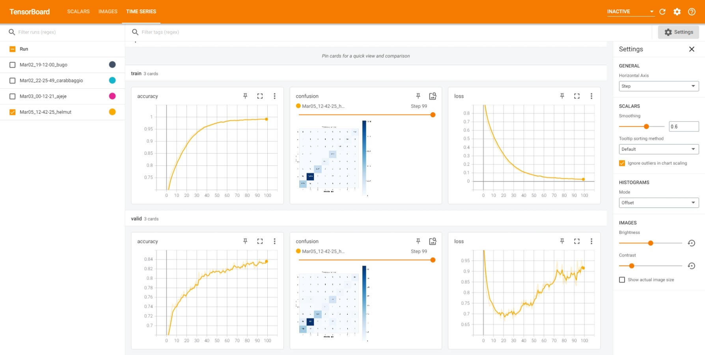

# PyTorch Skin Lesion Classification

This folder contains the skin lesion classification pipeline written in PyTorch.

## Install and run:
```shell
virtualenv myenv
source myenv/bin/activate
pip install -r requirements.txt
main.py /path_to/isic_classification.yml --gpu 1 --batch_size 24 --model resnet18 --onnx-export
```


### Results
Results can be monitored using tensorboard: `tensorboard --logdir runs`
